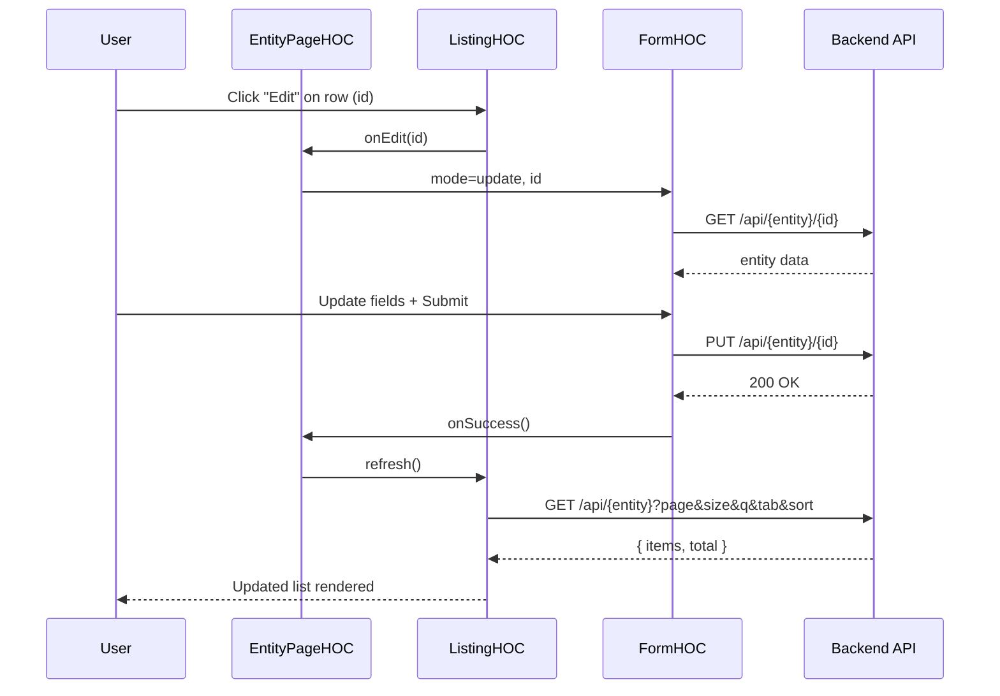
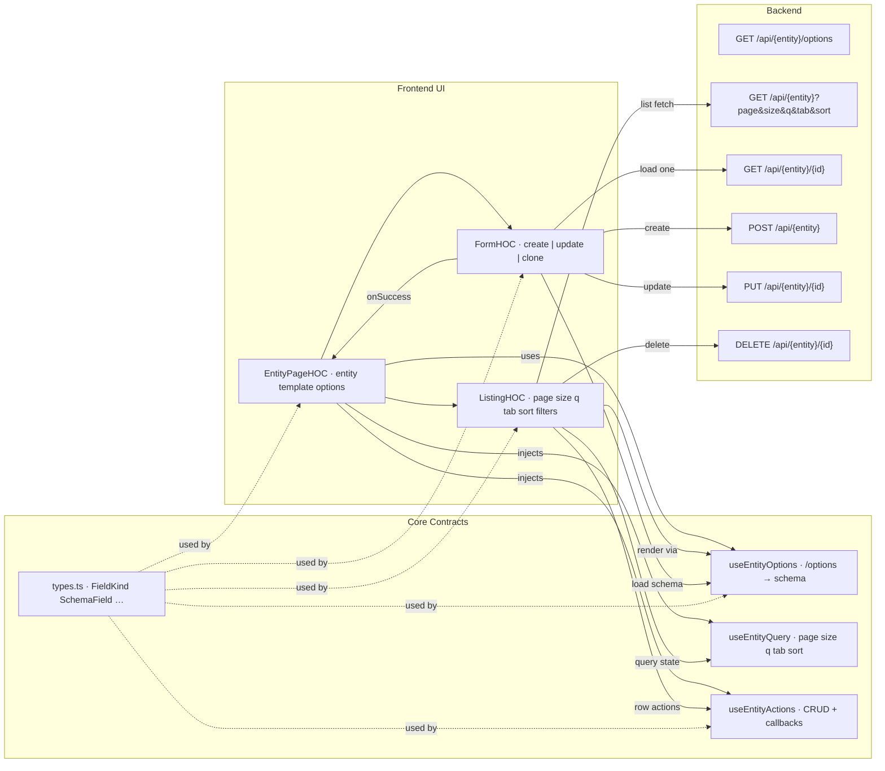

# Admin Framework Architecture Overview

The admin system is **fully dynamic**: every entity gets

- a **Form** (create/update)  
- a **Listing** (table/cards/accordion etc. for browse/search)  

Both are driven by backend `/options` + CRUD endpoints, so **no entity-specific UI code** is needed.

---

## Directory Structure


```
src/components/
  core/
    EntityPageHOC.tsx       // orchestrates form <-> list flow
    ListingHOC.tsx          // generic listing (data, filters, tabs, pagination)
    FormHOC.tsx             // generic form (create/update/clone)
    types.ts                // shared contracts (FieldKind, SchemaField, etc.)
    utils.ts                // normalize options, build queries, formatters
    constants.ts            // defaults (page size, debounce, tab keys)
    hooks/
      useEntityOptions.ts   // fetch + normalize /options
      useEntityQuery.ts     // manages page/size/q/tab/sort
      useEntityActions.ts   // CRUD + callbacks

  admin/
    shell/
      AdminShell.tsx        // thin entrypoint for admin
      Sidebar.tsx           // sidebar navigation (entities)
      Header.tsx            // top bar actions (new, filters, template switch)
    templates/
      list/
        TableTemplate.tsx   // wraps GenericTable
        CardTemplate.tsx    // optional
        AccordionTemplate.tsx // optional
      form/
        DefaultForm.tsx     // wraps GenericForm
        WizardForm.tsx      // optional (multi-step)
    context/
      dashboard-provider.tsx
    legacy/
      GenericForm.tsx
      GenericTable.tsx

  ui/ …                     // shared Shadcn components
  ThemeSwitcher.tsx
  theme-provider.tsx
  theme-registry.tsx
```


---

## Core Concepts

### EntityPageHOC
**Input**: `{ entity, template, options }`  

**State machine**:
- `list` → shows ListingHOC (table/cards/etc.)  
- `create` → shows FormHOC(mode=create)  
- `update` → shows FormHOC(mode=update, id)  

**Orchestration**:
- Fetches `/options` once → passes schema to ListingHOC + FormHOC  
- Handles transitions: New → Form, Edit → Form, Save → back to List + refresh  

---

### ListingHOC
**Handles**:
- Data load (`GET /api/{entity}`)  
- Tabs (`?tab=draft` etc.)  
- Filters, search, sort, pagination  
- Row/bulk actions (edit, delete, custom)  
- Delegates **UI rendering** to a template (`TableTemplate`, `CardTemplate`, etc.)  

---

### FormHOC
**Handles**:
- Create/update/clone  
- Loads schema from `/options`, and data for update/clone  
- Renders dynamic fields (string, number, bool, date, enum, fk)  
- Validation (required, type, min/max, regex, custom rules from backend)  
- Submits via `POST` (create/clone) or `PUT` (update)  
- Delegates **UI rendering** to form templates (`DefaultForm`, `WizardForm`)  

---

## Extensibility

- **Templates**:
  - Add new listing templates (`Kanban`, `Timeline`, `Tree`) under `admin/templates/list/`  
  - Add new form templates (`Wizard`, `Stepper`) under `admin/templates/form/`  

- **Client-specific overrides**:
  - Each client can register their own template.  
  - Example: `clients/pioneer/templates/list/PioneerTable.tsx`  
  - Config chooses template: `template: "pioneerTable"`  
  - HOC resolves dynamically.  

---

## Golden Rules

1. **EntityPage = Listing + Form.**  
   - Listing → browse/search/filter  
   - Form → create/update  

2. **Core defines contracts, not UI.**  
   - `EntityPageHOC`, `ListingHOC`, `FormHOC` live in `core/`  
   - UI is in templates (`admin/` or client-specific)  

3. **Backend drives UI.**  
   - `/options` provides schema, enums, fk, validators  
   - CRUD endpoints provide data  

4. **Only needed components load.**  
   - Next.js tree-shaking ensures unused templates/components are dropped  
   - Client-specific templates imported only if configured  






