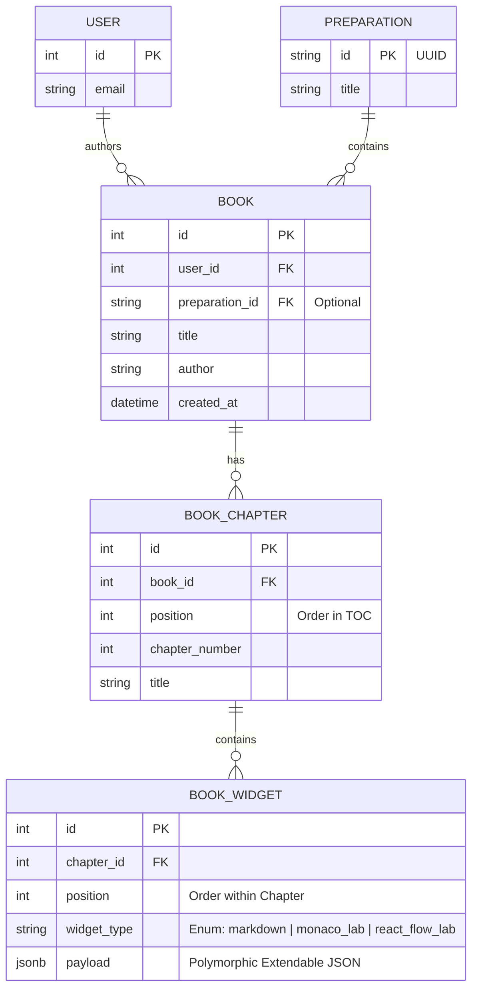

# Book Engine Architecture

This module implements the backend structure for the "O'Reilly-style" experiential labs and digital textbooks, providing a massive upgrade over simple static documentation.

## Entity Relationship Diagram (ERD)

Below is the database architecture powering the interactive Book layout. It links back natively to the core `User` and `Preparation` domains of the main platform.

### Extensibility Model

The core of the Book engine's power lies in the `BOOK_WIDGET` payload column. 

Instead of generating new database migration tables for every new type of interactive widget (e.g., an Ansible terminal, a Postgres live-editor, or an AWS Graph), the table uses **Polymorphic JSONB**. 

The `widget_type` determines how the frontend routes the rendering (e.g., to `<MonacoWidget />` vs `<ArchitectureWidget />`), while the `payload` strictly contains the exact JSON schema required by that frontend component (such as React Flow nodes/edges). This means you require **zero database migrations** to add new interactive lab types in the future.
